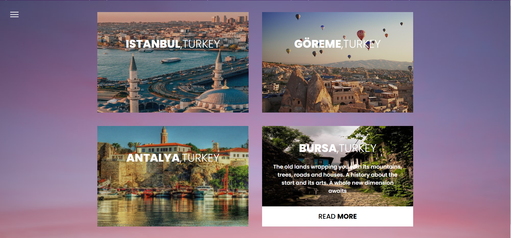
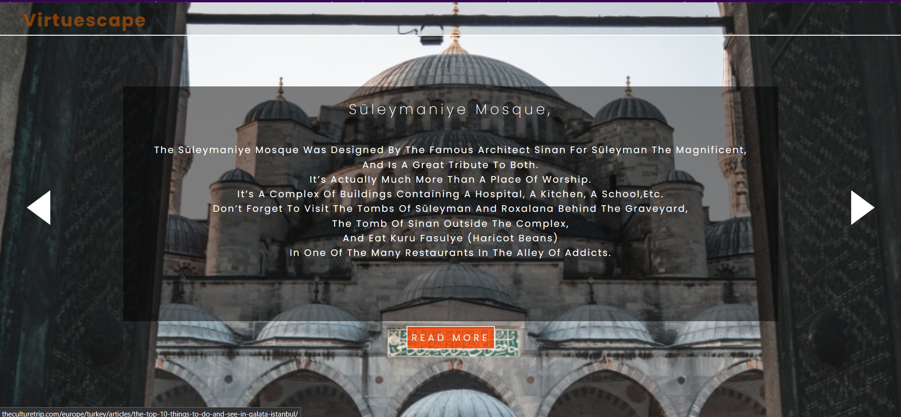

# 🌍 VirtueScape

**VirtueScape** is a web-based virtual travel experience created in 2020 during the COVID-19 pandemic. Built using **HTML**, **CSS**, and **JavaScript**, it was designed to help users explore iconic global destinations from the comfort and safety of their own homes.

🚀 **Live Demo**: [https://virtue-escape.netlify.app/](https://virtue-escape.netlify.app/)

---

## ✨ Overview

In a time when travel was restricted and people were craving connection with the world, VirtueScape offered an escape. The platform presents a curated set of destinations with visuals, ambient sounds, and descriptions that let users simulate travel — virtually.

### 🌐 Features

- Explore famous landmarks and cities across different continents  
- Visually immersive interface with smooth transitions  
- Lightweight and responsive design  
- No login or account required  

---

## 🛠️ Built With

- **HTML** – semantic structure  
- **CSS** – responsive, aesthetic layout  
- **JavaScript** – interactivity and navigation  

---

## 📅 Background

This project was created in 2020 as a response to the lockdowns and social distancing measures of the COVID-19 pandemic. VirtueScape aimed to offer a sense of escape and inspiration through digital means at a time when physical travel was impossible for many.

---

## 📦 Deployment

The app is deployed and hosted on **Netlify**:  
🔗 [https://virtue-escape.netlify.app/](https://virtue-escape.netlify.app/)

---
## 📸 Screenshots

### 🔐 Sign-In Page

### 🏠 Home Page

### 🇹🇷 Turkey Destination

### 🕌 Istanbul View

---

## 📄 License

This project is open for personal use and exploration. Feel free to fork, explore, and remix!
